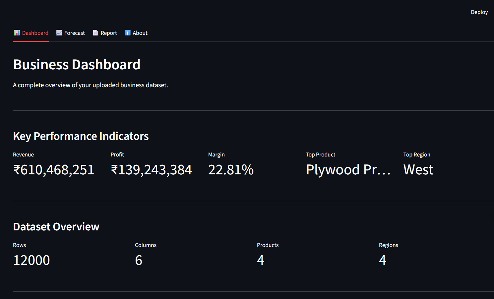
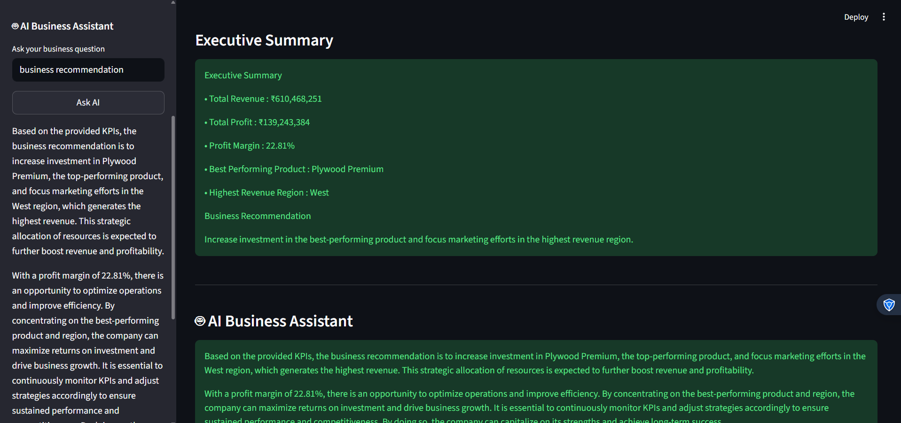
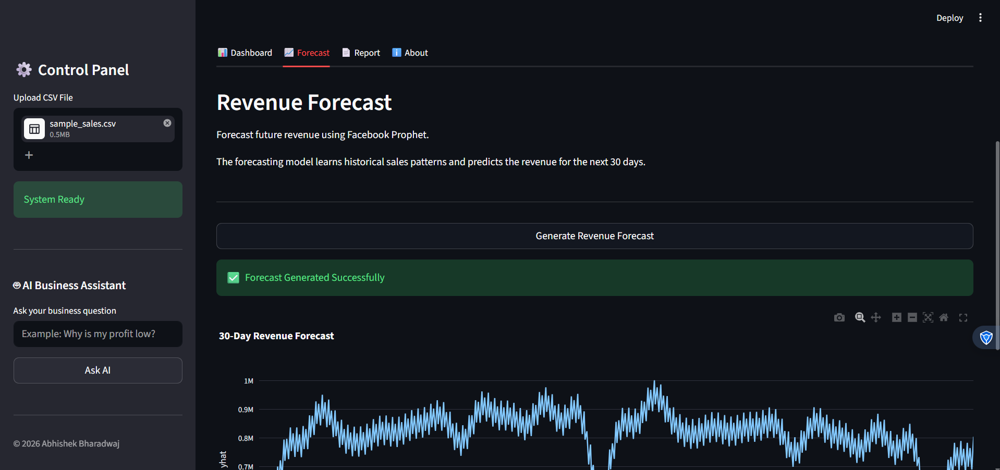
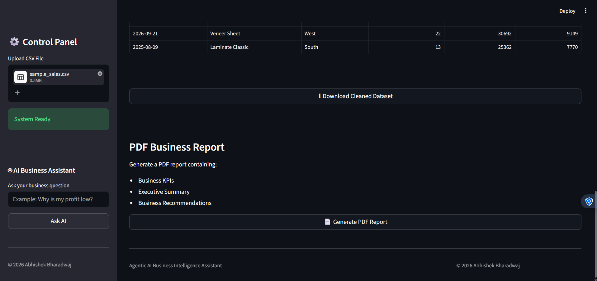
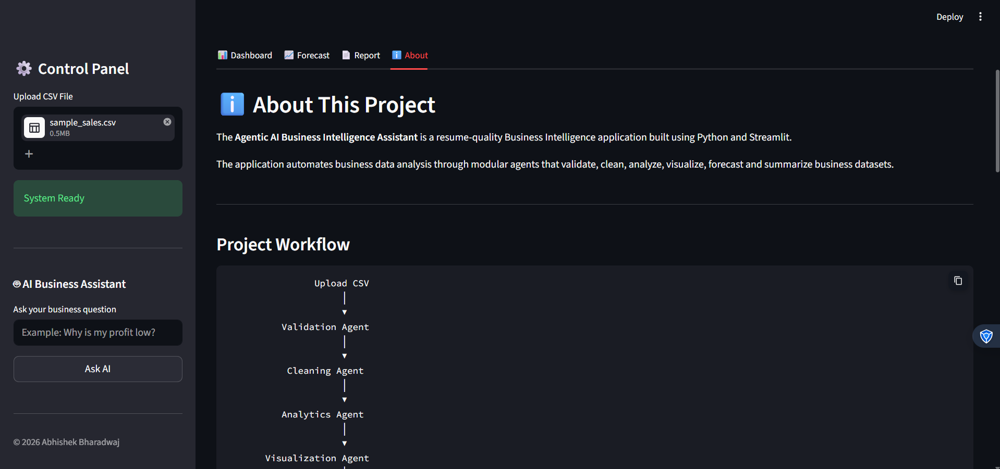

# 📊 Agentic AI Business Intelligence Assistant



An AI-powered **Business Intelligence Platform** that automates business data analysis using modular AI agents. The application validates, cleans, analyzes, visualizes, forecasts, and generates actionable business insights from uploaded CSV datasets while enabling natural language interaction through **Groq Llama 3**.

---


## 📌 Features

### 📂 Data Processing
- Upload business datasets in CSV format
- Automatic dataset validation
- Missing value handling
- Duplicate removal
- Standardized column formatting

### 📈 Business Analytics
- Total Revenue
- Total Profit
- Average Revenue
- Profit Margin
- Top Performing Product
- Top Revenue Region
- Top Products Analysis

### 📊 Interactive Dashboard
- KPI Cards
- Revenue Trend
- Revenue by Product
- Revenue by Region
- Dataset Overview
- Responsive Layout

### 📉 Revenue Forecasting
- 30-Day Revenue Forecast
- Facebook Prophet Time Series Model
- Interactive Forecast Visualization

### 🤖 AI Business Assistant
- Powered by **Groq API + Llama 3**
- Natural Language Business Queries
- Business Recommendations
- Executive Business Insights
- Lazy Loading Architecture

### 📄 Reporting
- Executive Summary
- PDF Report Generation
- Download Cleaned Dataset

---

# 🏗️ Project Workflow

```text
                    Upload CSV
                         │
                         ▼
               Validation Agent
                         │
                         ▼
                Cleaning Agent
                         │
                         ▼
               Analytics Agent
                         │
                         ▼
            Visualization Agent
                         │
                         ▼
             Forecasting Agent
                         │
                         ▼
          Executive Summary Agent
                         │
                         ▼
              PDF Report Agent
                         │
                         ▼
            AI Business Assistant
```

---

# 🏛️ Project Architecture

```
Agentic_AI_Business_Intelligence_Assistant/

│── app.py

├── agents/
│   ├── validation_agent.py
│   ├── cleaning_agent.py
│   ├── analytics_agent.py
│   ├── visualization_agent.py
│   ├── forecasting_agent.py
│   ├── summary_agent.py
│   ├── report_agent.py
│   └── query_agent.py

├── services/
│   └── llm_service.py

├── data/

├── reports/

├── screenshots/

├── .env

├── requirements.txt

└── README.md
```

---

# 📷 Application Screenshots

## 📊 Dashboard


---

## 🤖 AI Business Assistant



---

## 📈 Revenue Forecast



---

## 📄 Business Report



---

## ℹ️ About Page



---

# 🛠️ Technology Stack

| Category | Technologies |
|-----------|--------------|
| Programming | Python |
| Data Processing | Pandas |
| Visualization | Plotly |
| Forecasting | Prophet |
| AI | Groq API, Llama 3 |
| Frontend | Streamlit |
| Reporting | ReportLab |

---

# 🤖 AI Business Assistant

The application includes an AI-powered Business Assistant that answers business-related questions using the generated KPIs and executive summary.

### Example Questions

- What is my top-performing product?
- Which region generates the highest revenue?
- Give me business recommendations.
- Summarize my business performance.
- How can I improve my profit margin?
- Which KPIs should management focus on?

---

# ⚙️ Installation

## Clone Repository

```bash
git clone https://github.com/AbhishekBharadwaj2003/Agentic-AI-Business-Intelligence-Assistant.git

cd Agentic-AI-Business-Intelligence-Assistant
```

---

## Install Dependencies

```bash
pip install -r requirements.txt
```

---

## Configure Environment Variables

Create a `.env` file in the project root.

```env
GROQ_API_KEY=your_groq_api_key
```

---

## Run the Application

```bash
streamlit run app.py
```

---

# 📌 Key Highlights

- Modular Agent-Based Architecture
- Automated Business Intelligence Pipeline
- Interactive KPI Dashboard
- AI-Powered Business Query Assistant
- Revenue Forecasting using Prophet
- Professional PDF Report Generation
- Resume-Quality End-to-End Data Analytics Project
- Lazy Loading for Efficient AI Integration

---

# 🔮 Future Enhancements

- Excel File Support
- Multiple Dataset Upload
- User Authentication
- Cloud Database Integration
- Power BI Export
- Advanced Forecasting Models
- Role-Based Access Control
- Multi-language AI Responses

---

# 👨‍💻 Developer

**Abhishek Bharadwaj**

B.Tech – Electronics and Communication Engineering  
VIT-AP University

### Interests

- Data Analytics
- Business Intelligence
- Data Science
- Artificial Intelligence
- Machine Learning

---

# 🤝 Contributing

Contributions, feature suggestions, and improvements are welcome. Feel free to fork the repository and submit a pull request.

---

# 📜 License

This project is licensed under the **MIT License**.

---

## ⭐ If you found this project useful, please consider giving it a star!
